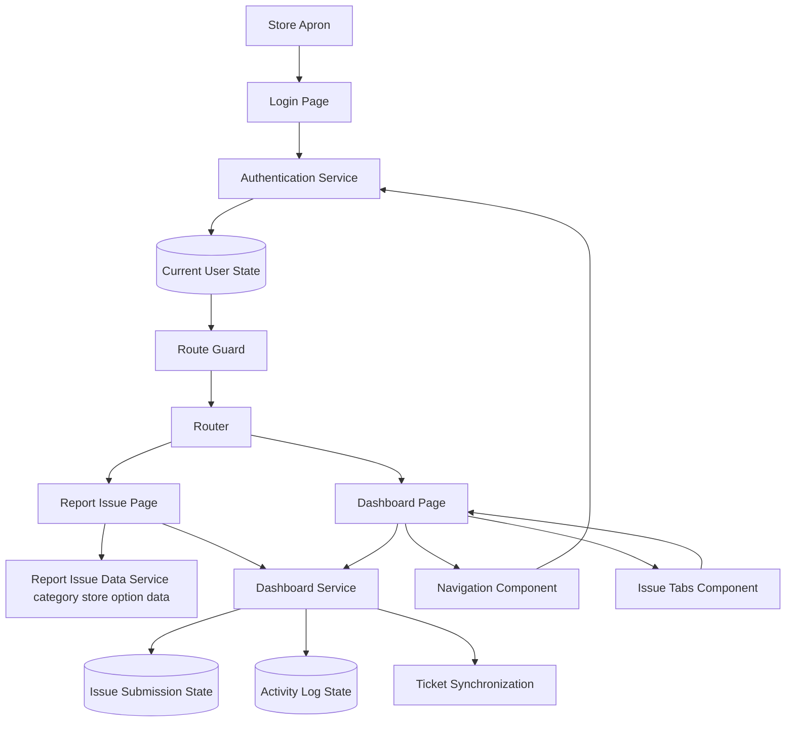

# StorePulse

StorePulse is an Angular 21 application built for The Home Depot store environment. It helps Aprons capture software issues while they are on the floor so the right support and engineering teams can act quickly.

The main goal is to make in-store issue reporting simple and complete. Each report captures store context, device details, issue severity, reproduction notes, and optional media evidence so software problems can be routed and resolved with less back and forth.

## Project Description

The application is centered around a simple incident workflow:

1. Associate signs in on `/login`.
2. Associate submits or saves an issue draft on `/report`.
3. Dashboard on `/dashboard` shows issue metrics, filters, activity, and drafts.
4. Issue can be synced to Jira and tracked through statuses (`draft`, `new`, `in-progress`, `resolved`).

Current implementation uses in-memory data services and simulated synchronization behavior, so it works like a realistic frontend prototype.

## How The Application Is Structured

- `pages`: Route-level screens (`login`, `report-issue`, `dashboard`).
- `core`: Cross-cutting app logic like auth guard, domain models, and services.
- `shared`: Reusable screen components and shared model/constants.
- `app.routes.ts`: Route map and auth protection.
- `app.config.ts`: Angular providers (router, network client, locale settings, and animations).

## Folder Structure

```text
src/
  app/
    app.ts
    app.config.ts
    app.routes.ts
    core/
      guards/
        auth.guard.ts
      models/
        user.model.ts
        dashboard.model.ts
      services/
        auth.service.ts
        dashboard.service.ts
        report-issue-data.service.ts
        jira.service.ts
        issue.service.ts
    pages/
      login/
      report-issue/
      dashboard/
    shared/
      components/
        navigation/
        issue-tabs/
        issue-card/
        status-badge/
        corporate-footer/
      models/
        constants.ts
        issue.models.ts
        issue.fixtures.ts
```

## Architecture Diagram



## Main Connections (Who Talks To What)

- Route protection checks whether the associate is signed in before opening report and dashboard pages.
- The login page signs in the associate and stores active user information for the session.
- The report page loads default category and store options, then creates new reports or saves drafts.
- The dashboard page reads reports, activity history, and store data, then presents filtering and inspection actions.
- The top navigation area allows user profile preference updates.
- Ticket synchronization actions are triggered from the dashboard and update report history.

## Run Locally

```bash
npm install
npm start
```

Open `http://localhost:4200`.

## Scripts

```bash
npm run start   # ng serve
npm run build   # ng build
npm run watch   # ng build --watch --configuration development
npm run test    # ng test (Vitest)
```
